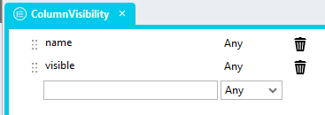
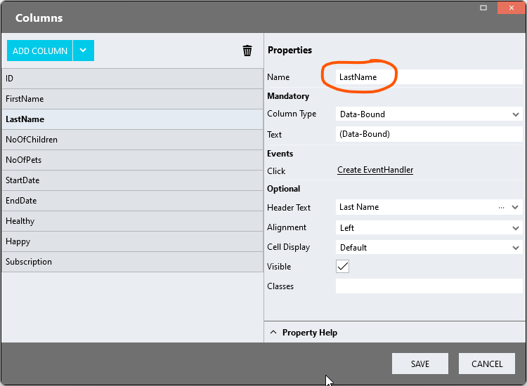

# Show & hide DataGrid columns programatically

A module that allows for showing and hiding DataGrid columns in scripts

https://github.com/stadium-software/datagrid-showhide-columns-programatically/assets/2085324/f6eeeb0c-a72a-416a-bfbe-8a482acb2590

# Version 
1.0 - initial

1.1 Changed column input to list of types (column & visibility); switched from DOM to using DataModel ColumnDefinitions visible property

## Application Setup
1. Check the *Enable Style Sheet* checkbox in the application properties

## Database, Connector and DataGrid
1. Use the instructions from [this repo](https://github.com/stadium-software/samples-database) to setup the database and DataGrid for this sample

## Global Script Setup
1. Create a Global Script called "ColumnHiding"
2. Add the input parameters below to the Global Script
   1. Columns
   2. DataGridClass
3. Drag a *JavaScript* action into the script
4. Add the Javascript below into the JavaScript code property
```javascript
/* Stadium Script v1.1 - see https://github.com/stadium-software/datagrid-showhide-columns-programatically */
let scope = this;
let arrCols = ~.Parameters.Input.Columns;
let inputClass = ~.Parameters.Input.DataGridClass;
let dgClassName = "." + inputClass;
let dg = document.querySelectorAll(dgClassName);
if (dg.length == 0) {
    console.error("No control with the class '" + inputClass + "' was found");
    return false;
} else if (dg.length > 1) {
    console.error("The class '" + inputClass + "' is assigned to multiple DataGrids. DataGrids using this script must have unique classnames");
    return false;
} else { 
    dg = dg[0];
}
initShowHide();
function initShowHide() { 
    let arrDefs = getDMValues(dg, "ColumnDefinitions");
    for (let i = 0; i < arrCols.length; i++) { 
        let ob = findObj(arrDefs, arrCols[i]);
        ob.visible = arrCols[i].visible;
    }
}
function findObj(arr, ob) {
    return arr.find(item => item.name === ob.name);
}
function getObjectName(obj) {
    let objname = obj.id.replace("-container","");
    do {
        let arrNameParts = objname.split(/_(.*)/s);
        objname = arrNameParts[1];
    } while ((objname.match(/_/g) || []).length > 0 && !scope[`${objname}Classes`]);
    return objname;
}
function getDMValues(ob, property) {
    let obname = getObjectName(ob);
    return scope[`${obname}${property}`];
}
```

## Type Setup
1. Add a type called "ColumnVisibility" to the types collection in the Stadium Application Explorer
2. Add the following properties to the type
   1. name (Any)
   2. visible (Any)



## Page Setup
1. Drag a *DataGrid* control to the page ([see above](#database-connector-and-datagrid))
2. Add a class of your choosing to the *DataGrid* *Classes* property that uniquely identifies this DataGrid on this page (e.g datagrid-hide-cols)

## Event Handler Setup
1. Populate your DataGrid with data ([see above](#database-connector-and-datagrid))
2. To hide or show columns when the event script runs
   1. Drag a *List* action into the script 
   2. Set the List Type to ColumnVisibility
   3. Add columns in sets containing
      1. Column name (as per the column definition indicated in screenshot below)
      2. Visibility boolean (booleans do not have quotes in Javascript)

List Value Example:
```json
= [{
	"name": "FirstName",
	"visible": false
},{
	"name": "LastName",
	"visible": false
}]
```



3. Drag the *ColumnHiding* script into the script and complete the input parameters
   1. Columns: Select your *List* containing the columns from the dropdown
   2. DataGridClass: The unique class you assigned to the *DataGrid* (e.g datagrid-hide-cols)
